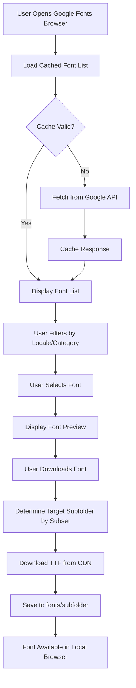
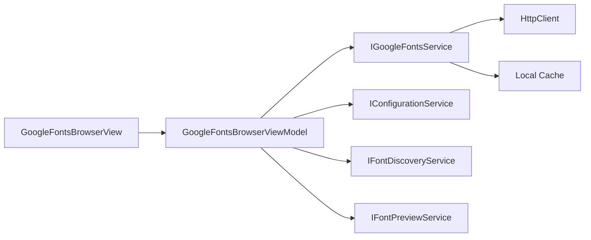
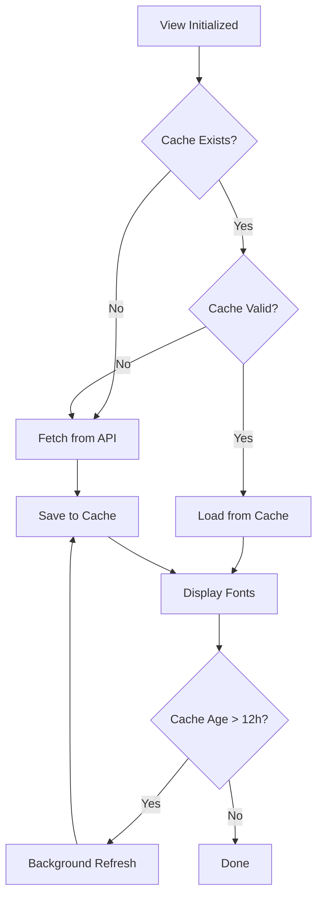
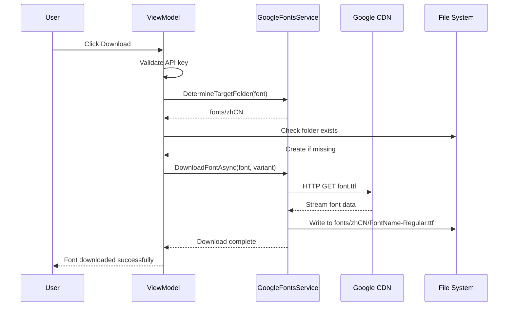
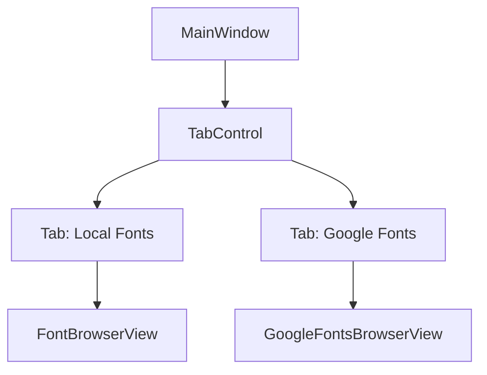
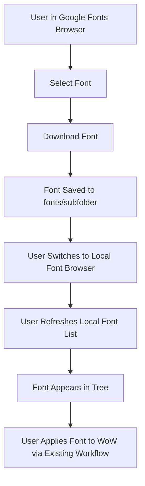
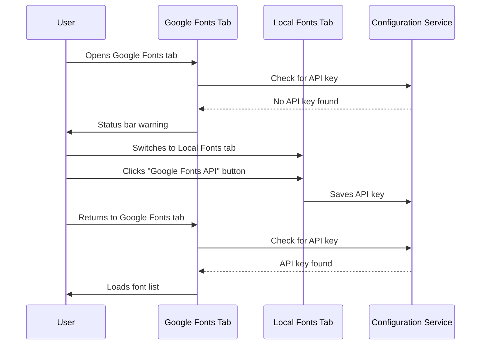

# Google Fonts Browser Interface Design

## Overview

This design introduces a new interface within WoW Font Manager that allows users to browse, preview, and download fonts from Google Fonts API. The interface integrates with the existing font browser infrastructure while adding cloud-based font discovery capabilities.

## Goals

1. Enable users to browse Google Fonts through an integrated UI
2. Support downloading fonts directly from Google Fonts CDN
3. Organize downloaded fonts by locale/subset into appropriate subfolders
4. Cache API responses to minimize network requests
5. Provide font preview capabilities for Google Fonts

## Non-Goals

- Font replacement functionality (handled by existing local font browser)
- Applying fonts directly to WoW from Google Fonts browser
- Modifying existing WoW font replacement workflow
- Implementing custom font search algorithms beyond API capabilities
- Supporting other third-party font services
- Offline font generation or conversion

## Architecture

### High-Level Flow



### Component Structure

The implementation follows MVVM pattern and integrates with existing service layer:



## Data Models

### GoogleFontFamily

Represents a font family from Google Fonts API.

| Field | Type | Description |
|-------|------|-------------|
| Family | string | Font family name |
| Variants | List&lt;string&gt; | Available font variants |
| Subsets | List&lt;string&gt; | Supported character subsets |
| Version | string | Font version identifier |
| LastModified | string | ISO date of last modification |
| Category | string | Font category |
| Files | Dictionary&lt;string, string&gt; | Variant to download URL mapping |
| Menu | string | Preview font file URL |

### GoogleFontsCache

Manages local caching of API responses.

| Field | Type | Description |
|-------|------|-------------|
| Fonts | List&lt;GoogleFontFamily&gt; | Cached font list |
| LastCacheUpdate | DateTime | Timestamp of last cache update |
| CacheExpiryHours | int | Cache validity period (default: 24) |

### FontDownloadInfo

Tracks font download operations.

| Field | Type | Description |
|-------|------|-------------|
| FontFamily | string | Name of font family |
| Variant | string | Specific variant being downloaded |
| DownloadUrl | string | Source URL |
| TargetPath | string | Local file system destination |
| Subset | string | Primary subset for folder organization |
| Progress | int | Download progress percentage |

## Service Layer

### IGoogleFontsService

New service interface for Google Fonts integration.

**Responsibilities:**
- Fetch font list from Google Fonts API
- Manage local cache of API responses
- Download font files from Google CDN
- Map subsets to locale-specific folders

**Key Methods:**

| Method | Parameters | Returns | Description |
|--------|-----------|---------|-------------|
| GetAllFontsAsync | includeCache: bool | Task&lt;List&lt;GoogleFontFamily&gt;&gt; | Retrieves complete font list |
| GetFontsBySubsetAsync | subset: string | Task&lt;List&lt;GoogleFontFamily&gt;&gt; | Filters fonts by subset |
| GetFontsByLocaleAsync | locale: string | Task&lt;List&lt;GoogleFontFamily&gt;&gt; | Filters by WoW locale mapping |
| DownloadFontAsync | fontFamily: GoogleFontFamily, variant: string, progress: IProgress&lt;int&gt; | Task&lt;string&gt; | Downloads font to appropriate subfolder |
| RefreshCacheAsync | - | Task | Forces cache refresh from API |
| ValidateApiKeyAsync | - | Task&lt;bool&gt; | Verifies API key validity |

### Locale to Subset Mapping

The service maintains mapping between WoW locales and Google Fonts subsets:

| WoW Locale | Primary Subset | Secondary Subsets | Target Folder |
|------------|----------------|-------------------|---------------|
| enUS | latin | latin-ext | fonts/enUS |
| zhCN | chinese-simplified | latin, latin-ext | fonts/zhCN |
| zhTW | chinese-traditional | latin, latin-ext | fonts/zhTW |
| jaJP | japanese | latin, latin-ext | fonts/jaJP |
| koKR | korean | latin, latin-ext | fonts/koKR |

**Subset Prioritization Logic:**
When a font supports multiple CJK subsets, the target folder is determined by the first matching subset in priority order: chinese-simplified, chinese-traditional, chinese-hongkong, japanese, korean.

## ViewModel Layer

### GoogleFontsBrowserViewModel

Manages state and user interactions for the Google Fonts browser.

**Observable Properties:**

| Property | Type | Description |
|----------|------|-------------|
| GoogleFonts | ObservableCollection&lt;GoogleFontFamily&gt; | Displayed font list |
| SelectedGoogleFont | GoogleFontFamily | Currently selected font |
| SelectedVariant | string | Selected font variant |
| IsLoadingFonts | bool | Loading state indicator |
| IsDownloading | bool | Download state indicator |
| DownloadProgress | int | Download progress (0-100) |
| StatusMessage | string | User-facing status text |
| SelectedLocale | string | Current locale filter |
| SelectedCategory | string | Current category filter |
| AvailableLocales | List&lt;string&gt; | Locale filter options |
| AvailableCategories | List&lt;string&gt; | Category filter options |

**Commands:**

| Command | Description |
|---------|-------------|
| LoadGoogleFontsCommand | Loads fonts from cache or API |
| RefreshGoogleFontsCommand | Forces refresh from API |
| DownloadFontCommand | Downloads selected font variant |
| FilterByLocaleCommand | Filters fonts by locale |
| FilterByCategoryCommand | Filters fonts by category |
| PreviewGoogleFontCommand | Renders preview of selected font |

**Workflow:**

1. **Initialization**: Load Google Fonts API key from configuration, check cache validity
2. **Loading**: Display cached fonts immediately if available, refresh in background if expired
3. **Filtering**: Apply locale and category filters client-side for instant response
4. **Preview**: Download menu font file temporarily, generate preview using IFontPreviewService
5. **Download**: Determine target folder, download TTF, save to fonts/subfolder

**Note:** After fonts are downloaded to the local fonts folder, users can switch to the existing local font browser to apply them to WoW. This module focuses solely on expanding the local font library with Google Fonts.

## View Layer

### GoogleFontsBrowserView

New Avalonia XAML view for Google Fonts browsing.

**UI Style Consistency:**

The Google Fonts browser MUST follow the existing application's visual design language to maintain consistency:

| Style Element | Specification | Reference |
|---------------|---------------|----------|
| Background Colors | Toolbar: #E8E8E8, Main panels: White/#F0F0F0/#F5F5F5 | FontBrowserView |
| Border Colors | #CCCCCC (toolbar), #DDDDDD (panel borders) | FontBrowserView |
| Text Colors | Primary: #1A1A1A, Secondary: #4A4A4A, Disabled: #999999 | FontBrowserView |
| Font Sizes | Headers: 14pt Bold, Body: 12pt, Status: 12pt | FontBrowserView |
| Button Styles | White background, #CCCCCC border, 1px thickness, 10-8 padding | FontBrowserView |
| Button Hover | Background: #E3F2FD (action buttons), #F5F5F5 (utility buttons) | FontBrowserView |
| Button Disabled | Background: #E8E8E8, Foreground: #999999 | FontBrowserView |
| Spacing | Panel padding: 10-20px, Control spacing: 10px | FontBrowserView |
| Border Radius | Rounded corners: 4px (where applicable) | FontBrowserView |
| Icons | Use emoji-style icons (📁 for folders, 🌐 for online fonts) | FontBrowserView |

**Layout Structure:**

```
┌─────────────────────────────────────────────────────────┐
│  Toolbar                                                 │
│  [Refresh] [Locale: ▼] [Category: ▼]                   │
├──────────────────┬──────────────────────────────────────┤
│                  │                                       │
│  Font List       │  Preview & Details Panel             │
│  (DataGrid)      │                                       │
│                  │  [Font Preview Image]                 │
│  - Family Name   │                                       │
│  - Category      │  Family: ...                          │
│  - Subsets       │  Variants: [▼]                        │
│                  │  Category: ...                        │
│                  │  Subsets: ...                         │
│                  │                                       │
│                  │  [Download Font]                      │
│                  │                                       │
│                  │  Progress: ████░░░░░ 60%             │
└──────────────────┴──────────────────────────────────────┘
│  Status: Loaded 1883 fonts for enUS                     │
└─────────────────────────────────────────────────────────┘
```

**Key UI Components:**

| Component | Type | Purpose | Style Notes |
|-----------|------|---------|-------------|
| Toolbar | Border/Grid | Filter controls and refresh button | Background: #E8E8E8, BorderBrush: #CCCCCC |
| LocaleFilter | ComboBox | Filter by locale | Match existing ComboBox style |
| CategoryFilter | ComboBox | Filter by category | Match existing ComboBox style |
| RefreshButton | Button | Refresh font list from API | Match utility button style (#F5F5F5 hover) |
| FontList | DataGrid | Displays searchable font list | White background, #DDDDDD borders |
| PreviewPanel | Border/DockPanel | Shows selected font details and preview | Background: #F0F0F0, rounded corners |
| PreviewImage | Image in ScrollViewer | Font preview rendering | White background border |
| VariantSelector | ComboBox | Choose font variant to download | Standard ComboBox style |
| DownloadButton | Button | Initiates font download | Action button style (#E3F2FD hover) |
| ProgressBar | ProgressBar | Shows download progress | Height: 20px, standard Avalonia style |
| StatusBar | Border/TextBlock | Displays operation status messages | Background: #E8E8E8, Text: #1A1A1A, Size: 12pt |

**Important:** 
- No "Apply to WoW" button is included. After downloading, users must use the existing local font browser to apply fonts to WoW.
- All visual styling (colors, fonts, spacing, borders) must precisely match FontBrowserView to ensure seamless user experience.
- Reuse existing XAML styles and resource dictionaries where available.

## Caching Strategy

### Cache Location

Fonts API cache stored at: `%LOCALAPPDATA%\WowFontManager\google-fonts-cache.json`

### Cache Structure

The cache file contains the complete API response plus metadata:

| Field | Type | Description |
|-------|------|-------------|
| lastCacheUpdate | ISO 8601 DateTime | Cache creation timestamp |
| cacheExpiryHours | int | Configured cache validity |
| fonts | Array of GoogleFontFamily | Complete font list |

### Cache Invalidation Rules

1. **Age-based**: Cache expires after 24 hours by default (configurable)
2. **Manual Refresh**: User-triggered via Refresh button bypasses cache
3. **API Key Change**: Cache invalidated when API key is modified
4. **Corruption Detection**: Invalid JSON triggers automatic refresh

### Cache Loading Behavior



## Download Workflow

### Folder Organization Logic

When downloading a font, the target folder is determined by primary subset:

**Decision Flow:**

1. Identify all subsets supported by the font
2. Match subsets against WoW locale mapping table
3. Select highest-priority matching subset
4. Map subset to target folder path

**Example Scenarios:**

| Font Subsets | Matched Locale | Target Folder | Rationale |
|--------------|----------------|---------------|-----------|
| latin, latin-ext | enUS | fonts/enUS | Default for Latin scripts |
| chinese-simplified, latin | zhCN | fonts/zhCN | CJK takes priority |
| chinese-traditional, latin | zhTW | fonts/zhTW | Traditional Chinese variant |
| japanese, latin | jaJP | fonts/jaJP | Japanese locale |
| latin only | enUS | fonts/enUS | Fallback to enUS |

### Download Process



### File Naming Convention

Downloaded fonts use consistent naming:

**Format:** `{FamilyName}-{Variant}.ttf`

**Examples:**
- Noto Sans SC-Regular.ttf
- Roboto-Bold.ttf
- Merriweather-Italic.ttf

**Collision Handling:**
If a file with the same name exists, append a numeric suffix: FontName-Regular (1).ttf

## Integration with Existing Features

### Main Window Navigation

The application currently has a single-view MainWindow that directly displays FontBrowserView. To accommodate the new Google Fonts browser, the MainWindow needs to be updated to support multiple views.

**Navigation Strategy:**

Implement a TabControl-based navigation in MainWindow to switch between:
1. Local Fonts Browser (existing FontBrowserView)
2. Google Fonts Browser (new GoogleFontsBrowserView)

**MainWindow Layout Changes:**



**Tab Placement and Style:**

| Element | Specification |
|---------|---------------|
| Location | Top of MainWindow, below title bar |
| Tab Labels | "Local Fonts" and "Google Fonts" |
| Tab Style | Match Avalonia default TabControl style |
| Background | Consistent with existing UI (#E8E8E8 for tab strip) |
| Active Tab | Highlighted to indicate current view |
| Icons | 📁 for Local Fonts, 🌐 for Google Fonts (optional) |

**Alternative Navigation Options:**

If TabControl is deemed too intrusive, alternative approaches:

1. **Button in Toolbar:** Add "Browse Google Fonts" button in FontBrowserView toolbar (right side, near existing buttons)
2. **Menu Bar:** Add a top-level menu with View > Local Fonts / Google Fonts
3. **Side Panel:** Add a collapsible navigation panel on the left side

**Recommended Approach:** TabControl provides the clearest navigation and aligns with common desktop application patterns. Users can easily switch between local and online font sources.

### Font Browser Integration

The Google Fonts browser operates as a separate tab/view within the main window alongside the local font browser.

**Shared Capabilities:**
- Both browsers use the same IFontPreviewService for rendering
- Downloaded Google Fonts appear in the local browser after user manually refreshes or restarts

**Workflow Integration:**



**Scope Boundary:**
- Google Fonts browser: Browse, preview, and download only
- Local font browser: All font replacement functionality
- No modifications to existing WoW font replacement workflow

### Configuration Service Extension

The existing AppSettings class already includes GoogleFontsApiKey property. No model changes required.

**Additional Settings to Track:**

| Setting Key | Type | Default | Description |
|-------------|------|---------|-------------|
| GoogleFontsCacheExpiryHours | int | 24 | Cache validity period |
| GoogleFontsLastRefresh | DateTime? | null | Last successful API call |
| GoogleFontsDefaultLocale | string | "enUS" | Default locale filter |

## Error Handling

### API Key Management

**Existing Implementation:**

The Google Fonts API key management is already implemented in the existing FontBrowserView via the "Google Fonts API" button. The key is stored in AppSettings.GoogleFontsApiKey and persisted to the local configuration file.

**Google Fonts Browser Behavior:**

The new GoogleFontsBrowserView does NOT include its own API key configuration UI. Instead:

1. On view initialization, check if API key exists in configuration
2. If API key is missing or empty:
   - Display warning in status bar: "Google Fonts API key not configured. Please configure it in the Local Fonts tab."
   - Disable font loading and download functionality
   - Show empty state message in font list area
3. If API key is present:
   - Proceed with normal font list loading
   - Validate key on first API call
   - If key is invalid, display error in status bar

**User Workflow for API Key Setup:**



**Status Messages:**

| Condition | Status Bar Message |
|-----------|--------------------|
| API key not configured | "Google Fonts API key not configured. Please configure it in the Local Fonts tab." |
| API key invalid (403 error) | "Invalid Google Fonts API key. Please update it in the Local Fonts tab." |
| API key valid | "Loaded {count} fonts for {locale}" |

### Error Scenarios and Responses

| Scenario | Detection | User Feedback | Recovery Action |
|----------|-----------|---------------|-----------------|
| Missing API Key | On view load | Status bar: "Google Fonts API key not configured. Please configure it in the Local Fonts tab." | User switches to Local Fonts tab and uses existing "Google Fonts API" button |
| Invalid API Key | API returns 403 | Status bar: "Invalid Google Fonts API key. Please update it in the Local Fonts tab." | User switches to Local Fonts tab and updates key |
| Network Failure | HTTP timeout | "Unable to connect to Google Fonts API" | Retry with exponential backoff |
| Cache Corruption | JSON parse error | "Cache corrupted, refreshing from API" | Delete cache, fetch fresh |
| Download Failure | HTTP error during download | "Download failed: {error}" | Allow retry |
| Insufficient Disk Space | IO exception on write | "Insufficient disk space to save font" | Suggest cleanup |
| API Rate Limit | 429 response | "Rate limit exceeded, please try again later" | Disable refresh for cooldown period |

### Retry Strategy

**Network Operations:**
- Initial timeout: 30 seconds
- Retry attempts: 3
- Backoff: Exponential (1s, 2s, 4s)
- User control: Cancel button available during retry

**Download Operations:**
- Resume support: Not implemented (files typically small)
- Progress persistence: Download progress lost on cancel
- Partial file cleanup: Automatically delete incomplete downloads

## Security Considerations

### API Key Protection

**Current Implementation:**
- API key stored in AppSettings as plain text
- Configuration file saved to %LOCALAPPDATA%\WowFontManager\settings.json
- File permissions rely on OS user isolation

**Recommendations:**
- Clearly document that API key storage is not encrypted
- Advise users to restrict API key usage via Google Cloud Console:
  - Enable HTTP referrer restrictions where applicable
  - Set quota limits to prevent abuse
  - Use least-privilege API key (only Google Fonts API enabled)

**User Guidance:**
Display security notice when user sets API key:
> "Your API key will be stored locally in plain text. For security, we recommend restricting this key in Google Cloud Console to prevent unauthorized use."

### Network Security

**HTTPS Enforcement:**
- All Google Fonts API calls use HTTPS
- All CDN downloads from fonts.gstatic.com use HTTPS
- Certificate validation enabled by default in HttpClient

**File Validation:**
- Verify TTF file signature after download
- Validate file size matches expected range
- Reject downloads exceeding size threshold (e.g., 50MB)

## Performance Optimization

### Lazy Loading

**Font List Rendering:**
- Use virtualization in DataGrid for large font lists
- Render only visible rows to maintain responsiveness
- Estimated row count: ~1,900 for enUS, ~10-70 for CJK locales

### Preview Optimization

**Menu Font Strategy:**
- Download lightweight menu font file for preview
- Cache menu fonts separately from full fonts
- Menu font cache location: `%LOCALAPPDATA%\WowFontManager\previews\`
- Auto-cleanup: Remove previews older than 7 days

### Concurrent Operations

**Download Parallelization:**
- Allow maximum 3 concurrent downloads
- Queue additional downloads
- Display queue position in status message

### API Request Optimization

**Batch Operations:**
- Single API call fetches complete font list
- Client-side filtering eliminates additional API calls
- Cache minimizes API usage to once per 24 hours


## UI/UX Considerations

### Progressive Disclosure

**Initial View State:**
- Display cached fonts immediately (if available)
- Show loading spinner during background refresh
- Enable filtering even while loading

**Empty State:**
- When no API key configured: "Configure Google Fonts API key to browse cloud fonts"
- When no fonts match filter: "No fonts found for selected criteria"
- When cache empty and offline: "Unable to load fonts. Check internet connection."

### User Feedback

**Loading States:**
- Initial load: "Loading Google Fonts..."
- Background refresh: Small indicator in toolbar, non-blocking
- Download: Progress bar with percentage and font name

**Success Confirmations:**
- Download complete: "Font downloaded to fonts/zhCN/"
- Cache refresh: "Font list updated (1,899 fonts available)"

### Accessibility

**Keyboard Navigation:**
- Tab order: Filters → Font list → Preview panel → Download button
- Enter key on font list item: Select and preview
- Ctrl+R: Refresh fonts
- Ctrl+D: Download selected font

**Screen Reader Support:**
- Announce font count when list loads
- Announce filter changes
- Announce download progress milestones (25%, 50%, 75%, 100%)

## Future Enhancements

### Out of Scope for Initial Release

The following features are intentionally excluded to maintain focus and manage complexity:

1. **Advanced Search:** Full-text search within font families (use client-side filtering initially)
2. **Font Comparison:** Side-by-side comparison of multiple fonts
3. **Batch Download:** Download multiple fonts simultaneously
4. **Custom Subset Selection:** Allow user to choose specific subsets when downloading
5. **Variable Font Support:** Google Fonts variable font format integration
6. **Auto-Update:** Automatically update downloaded fonts when new versions available
7. **Font Ratings/Popularity:** Display usage statistics from Google Fonts
8. **Web Font Preview:** Preview fonts using web rendering before download

### Extension Points

The design provides hooks for future expansion:

- IGoogleFontsService interface can be extended with additional methods
- GoogleFontFamily model includes version field for update detection
- Cache structure supports metadata extension without breaking changes
- Folder organization logic isolated in service layer for future customization

## Acceptance Criteria

1. Users can browse all 1,899 Google Fonts with valid API key
2. Fonts filter correctly by locale (enUS, zhCN, zhTW, jaJP, koKR)
3. Fonts filter correctly by category (sans-serif, serif, monospace, display, handwriting)
4. Font preview displays correctly for selected fonts
5. Downloaded fonts save to appropriate subfolder (fonts/enUS, fonts/zhCN, etc.)
6. Download progress displays accurately during font download
7. Cache reduces API calls to maximum once per 24 hours
8. Error messages provide actionable guidance for common issues
9. No font replacement functionality included in Google Fonts browser
10. Existing WoW font replacement workflow remains unchanged

**Performance Targets:**

- Initial font list load: < 2 seconds (with cache)
- Font preview generation: < 1 second
- Single font download: < 10 seconds (typical broadband)
- UI remains responsive during background operations
