# WoW Font Manager Tool Design

## Overview

### Purpose
A specialized font management tool designed for World of Warcraft players to browse, preview, and replace game fonts. The application enables users to:
- Browse and preview font files with real-time rendering
- Select WoW client installations (Retail, Classic, Classic Era)
- Replace game fonts by category (Main UI, Chat, Combat Damage)
- Support multiple WoW localizations (enUS, zhCN, zhTW)
- Ensure proper CJK font rendering for Asian language clients

### Target Platforms
- Windows 10/11
- macOS 10.15+

### Technology Stack
- **UI Framework**: Avalonia UI (cross-platform XAML-based framework)
- **Rendering Engine**: SkiaSharp (high-performance 2D graphics)
- **Runtime**: .NET 8.0 or later
- **Language**: C#
- **File Operations**: System.IO for font file replacement
- **Configuration**: JSON-based WoW client detection

### Performance Targets
- Binary size: 15-25 MB (self-contained deployment)
- Font preview rendering: < 100ms for standard fonts, < 300ms for complex CJK fonts
- UI responsiveness: 60 FPS during interactions
- Memory footprint: < 150 MB for typical usage (viewing 100+ fonts)

## Architecture

### System Architecture

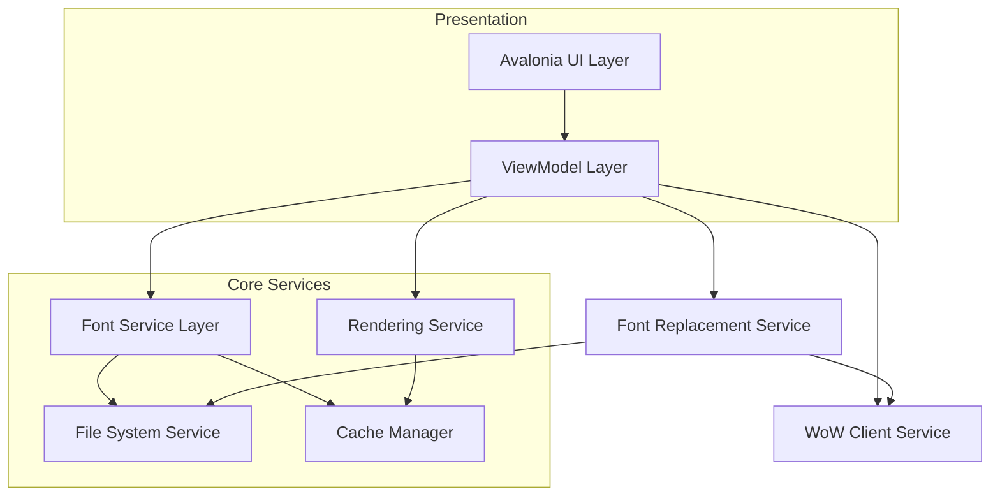

### Component Architecture

| Layer | Component | Responsibility |
|-------|-----------|----------------|
| **Presentation** | MainWindow | Primary application window, hosts directory browser and preview panel |
| | DirectoryBrowserView | Tree/list view for navigating font directories |
| | FontPreviewView | Real-time font rendering with sample text |
| | MetadataView | Display font properties and technical details |
| **ViewModel** | MainViewModel | Application state, navigation coordination |
| | DirectoryViewModel | Directory tree state, selection management |
| | FontPreviewViewModel | Preview text, font selection, rendering parameters |
| | MetadataViewModel | Font metadata presentation logic |
| **Service** | FontDiscoveryService | Scan directories, identify font files |
| | FontMetadataService | Extract font properties using SkiaSharp |
| | RenderingService | Generate font previews with SkiaSharp |
| | CacheService | LRU cache for parsed fonts and rendered previews |
| | WoWClientService | Detect WoW installations, manage client paths |
| | FontReplacementService | Backup and replace WoW font files |
| **Infrastructure** | FileSystemWatcher | Monitor directory changes in real-time |
| | ConfigurationService | User preferences persistence |

## Core Features

### 1. WoW Client Management

#### Functional Requirements
- Auto-detect WoW installations from common paths
- Support manual client path selection
- Identify client type (Retail, Classic, Classic Era)
- Detect client locale (enUS, zhCN, zhTW, etc.)
- Validate Fonts directory existence and permissions
- Display client version and installation status

#### WoW Client Detection Strategy

**Default Search Paths**:

| Platform | Search Locations |
|----------|------------------|
| Windows | `C:\Program Files (x86)\World of Warcraft\` |
| | `C:\Program Files\World of Warcraft\` |
| | Custom Battle.net installation paths |
| macOS | `/Applications/World of Warcraft/` |
| | `~/Applications/World of Warcraft/` |

**Client Type Detection**:

| Client Type | Directory Pattern | Fonts Path |
|-------------|-------------------|------------|
| Retail | `_retail_/` | `_retail_/Fonts/` |
| Classic (Wrath/Cata) | `_classic_/` | `_classic_/Fonts/` |
| Classic Era (Vanilla) | `_classic_era_/` | `_classic_era_/Fonts/` |

**Locale Detection**:
- Read from `WTF/Config.wtf` file (SET textLocale "xxXX")
- Fallback to system locale
- Allow manual override

#### Client Selection Interface

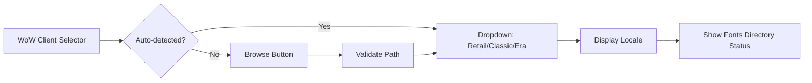

#### Client Data Model

| Property | Type | Description |
|----------|------|-------------|
| ClientType | Enum | Retail, Classic, ClassicEra |
| InstallationPath | String | Root WoW directory |
| FontsPath | String | Full path to Fonts directory |
| Locale | String | Detected client locale (e.g., "zhCN") |
| IsValid | Boolean | Whether Fonts directory is accessible |
| Version | String | Client version string (optional) |
| DisplayName | String | User-friendly name for dropdown |

### 2. Font Replacement Control Panel

#### Functional Requirements
- Display replacement options based on selected client locale
- Support batch font replacement by category
- Create automatic backups before replacement
- Validate font file compatibility
- Show replacement status and confirmation
- Provide rollback functionality

#### Replacement Categories

**Category Mapping by Locale**:

| Category | enUS Files | zhCN Files | zhTW Files |
|----------|-----------|-----------|------------|
| **All Fonts** | All below | All below | All below |
| **Main UI** | FRIZQT__.ttf MORPHEUS.ttf | ARKai_T.ttf FRIZQT__.ttf ZYKai_T.ttf | bLEI00D.ttf bHEI00M.ttf FRIZQT__.ttf ARKai_C.ttf |
| **Chat** | ARIALN.ttf | ARHei.ttf ARIALN.ttf ZYHei.ttf | arheiuhk_bd.ttf bHEI01B.ttf ARIALN.ttf |
| **Damage/Combat** | SKURRI.ttf | ARKai_C.ttf ZYKai_C.ttf | bKAI00M.ttf |

#### Replacement Workflow

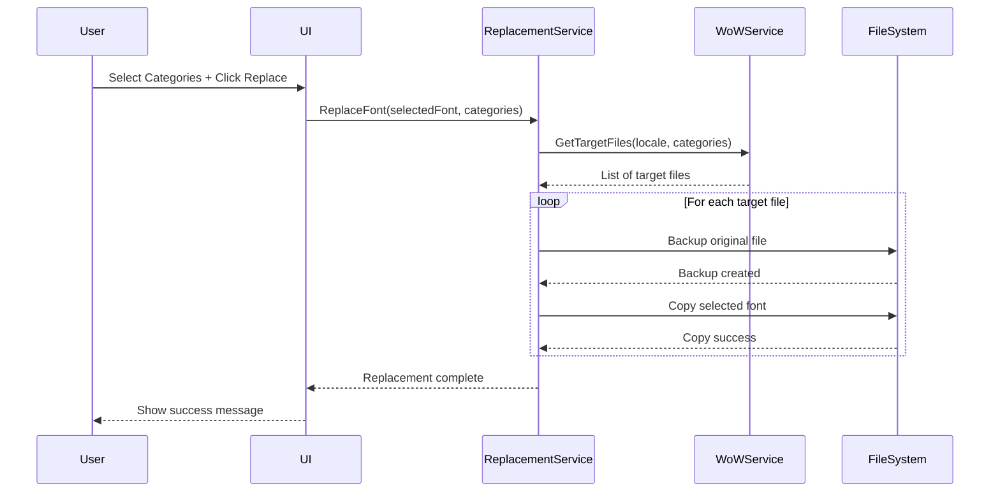

#### Replacement Control Interface

**Layout Structure**:

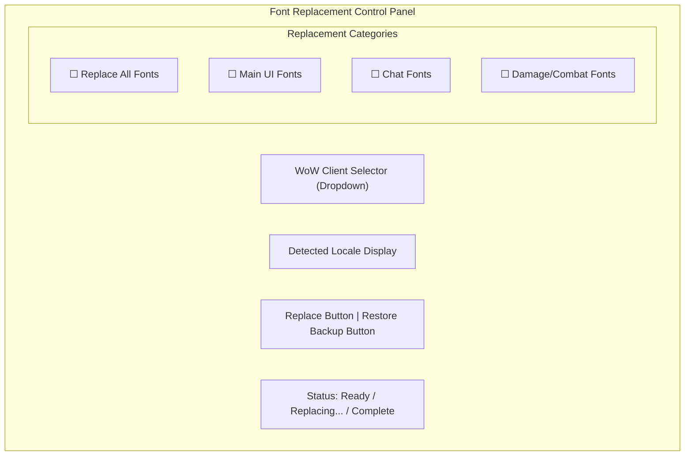

**Checkbox Behavior**:
- "Replace All Fonts" checkbox: When checked, disables and auto-checks all other categories
- Individual categories: Can be combined (e.g., Main UI + Chat)
- At least one category must be selected to enable Replace button

#### Backup Management

**Backup Strategy**:

| Aspect | Implementation |
|--------|----------------|
| Backup Location | `{WoW_Fonts_Dir}/FontBackup_{timestamp}/` |
| Naming Convention | Original filename preserved |
| Backup Metadata | JSON file with replacement date, source font, categories |
| Auto-cleanup | Keep last 5 backups, delete older |
| Restoration | One-click restore to previous state |

**Backup Metadata Structure**:

| Field | Type | Description |
|-------|------|-------------|
| BackupDate | DateTime | When backup was created |
| SourceFont | String | Path to font used for replacement |
| ReplacedFiles | List<string> | List of original files backed up |
| ClientType | String | Retail/Classic/Era |
| Locale | String | Client locale at time of backup |
| Categories | List<string> | Which categories were replaced |

#### Validation Rules

**Pre-Replacement Checks**:

| Check | Failure Action |
|-------|----------------|
| WoW client selected | Show error: "Please select a WoW client" |
| Fonts directory writable | Show error: "Insufficient permissions, run as administrator" |
| Source font valid | Show error: "Selected font is corrupted or invalid" |
| At least one category selected | Disable Replace button |
| WoW game not running | Show warning: "Close WoW before replacing fonts" |

#### Post-Replacement Confirmation

**Success Message**:
- Display count of files replaced
- Show backup location
- Provide option to open Fonts directory
- Remind user to restart WoW client

**Error Handling**:
- Partial failure: List which files succeeded/failed
- Automatic rollback on critical errors
- Detailed error log for troubleshooting

### 3. Directory Browser

#### Functional Requirements
- Browse and select directories containing font files
- Support drag-and-drop of folders into the application
- Display hierarchical folder structure with font count indicators
- Filter by font file extensions (.ttf, .otf, .ttc, .woff, .woff2)
- Remember last browsed directory across sessions

#### User Interaction Flow

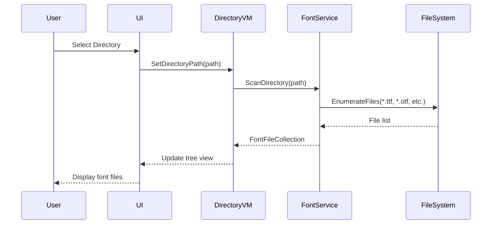

#### Directory Structure Display

| Column | Description | Data Source |
|--------|-------------|-------------|
| Name | File name without extension | File system |
| Type | Font format (TrueType, OpenType, etc.) | File extension analysis |
| Size | File size in KB/MB | File metadata |
| Family | Font family name | Font metadata extraction |

### 4. Font Preview

#### Functional Requirements
- Display real-time preview with customizable sample text
- Support multiple preview sizes (12pt, 16pt, 24pt, 36pt, 48pt, 72pt)
- Render both Latin and CJK characters with proper glyph handling
- Show character coverage indicators (Latin, CJK, symbols)
- Enable comparison mode (side-by-side preview of multiple fonts)

#### Default Sample Texts

| Language | Sample Text |
|----------|-------------|
| English | The quick brown fox jumps over the lazy dog |
| Chinese (Simplified) | 永和九年，岁在癸丑，暮春之初，会于会稽山阴之兰亭 |
| Chinese (Traditional) | 永和九年，歲在癸丑，暮春之初，會於會稽山陰之蘭亭 |
| Japanese | いろはにほへと ちりぬるを わかよたれそ |
| Korean | 다람쥐 헌 쳇바퀴에 타고파 |
| Numbers | 0123456789 |
| Symbols | !@#$%^&*()_+-=[]{}|;':",./<>? |

#### Preview Rendering Flow

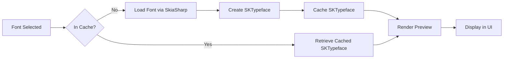

#### Performance Optimization Strategy
- Lazy loading: Render previews only when visible in viewport
- LRU cache: Keep 50 most recently used font typefaces in memory
- Thumbnail generation: Pre-render small previews for list view
- Background rendering: Use async tasks for complex CJK fonts

### 5. Font Metadata Extraction

#### Metadata Properties

| Category | Properties | Extraction Method |
|----------|-----------|-------------------|
| **Identification** | Font Family, Subfamily, Full Name, PostScript Name | SkiaSharp SKTypeface properties |
| **Technical** | Format (TrueType/OpenType), Version, Embedding Permissions | Font table parsing (name, OS/2 tables) |
| **Metrics** | Units Per Em, Ascent, Descent, Line Gap | SkiaSharp metrics API |
| **Glyphs** | Glyph Count, Character Coverage Ranges | SkiaSharp glyph enumeration |
| **Designer** | Designer Name, Copyright, Trademark | Font name table entries |
| **File** | File Size, File Path, Last Modified Date | File system metadata |

#### Metadata Display Layout

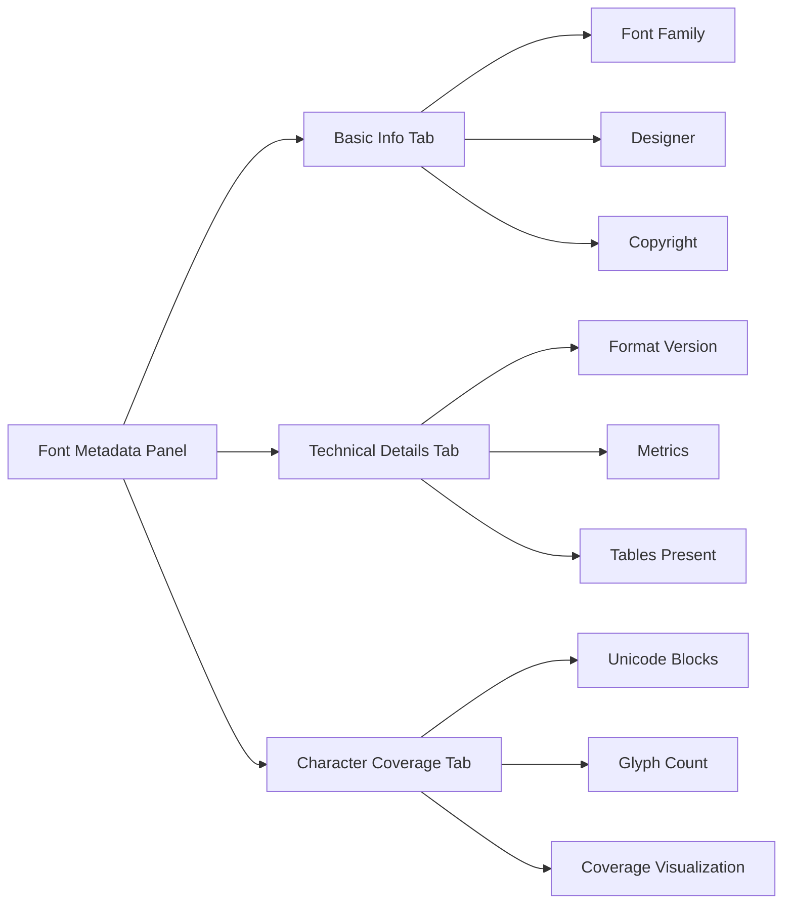

### 6. CJK Font Support

#### Special Handling Requirements
- Large glyph sets: CJK fonts typically contain 20,000+ glyphs
- Complex rendering: Proper handling of vertical text, ruby annotations
- Fallback chains: Display missing glyphs with appropriate indicators
- Performance: Optimize rendering for large character sets

#### Character Coverage Detection

| Unicode Block | Range | Purpose |
|---------------|-------|---------|
| CJK Unified Ideographs | U+4E00 to U+9FFF | Common Chinese characters |
| CJK Extension A | U+3400 to U+4DBF | Rare Chinese characters |
| Hiragana | U+3040 to U+309F | Japanese phonetic |
| Katakana | U+30A0 to U+30FF | Japanese phonetic |
| Hangul Syllables | U+AC00 to U+D7AF | Korean characters |

#### CJK Preview Strategy
- Display mixed script samples showing character variety
- Highlight missing glyphs with fallback indicators
- Provide script-specific sample texts for accurate testing
- Measure and display glyph coverage percentages per block

## User Interface Design

### Main Window Layout

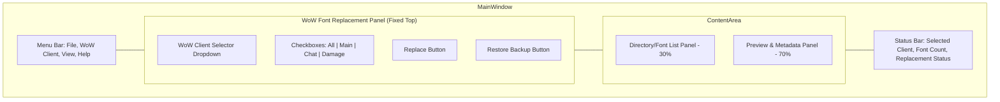

### View Components

#### WoW Font Replacement Panel (Fixed Header)

**Layout**: Fixed position at top of window, always visible

**Components**:

| Component | Type | Properties |
|-----------|------|------------|
| Client Selector | ComboBox | Items: Auto-detected clients + "Browse..." option |
| Locale Display | TextBlock | Read-only, shows detected locale |
| All Fonts Checkbox | CheckBox | Master checkbox, controls all others |
| Main UI Checkbox | CheckBox | Independent selection |
| Chat Checkbox | CheckBox | Independent selection |
| Damage Checkbox | CheckBox | Independent selection |
| Replace Button | Button | Enabled only when client + category selected |
| Restore Button | Button | Enabled when backups exist |
| Status Indicator | ProgressBar/TextBlock | Shows operation progress |

**State Management**:

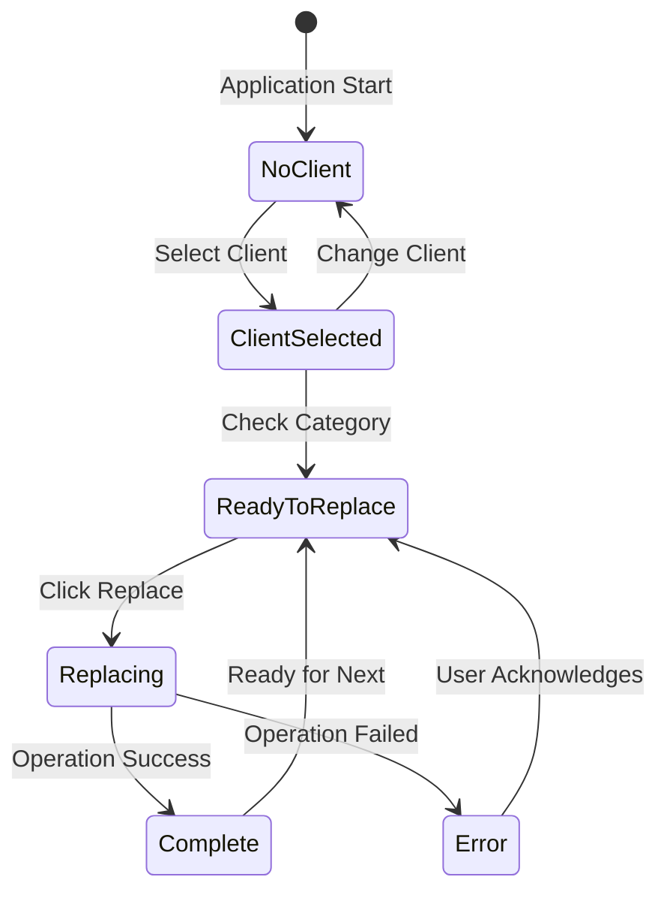

**Visual Feedback**:
- Client selector: Green checkmark if valid, red X if invalid
- Category checkboxes: Show file count tooltip (e.g., "3 files")
- Replace button: Disabled state when prerequisites not met
- Progress indicator: Animated during replacement operation

#### Directory/Font List Panel
- **Tree View Mode**: Hierarchical directory structure with expandable nodes
- **List View Mode**: Flat list of all discovered fonts
- **Search Box**: Filter fonts by name, family, or designer
- **Sort Options**: Name, Size, Date Modified, Font Family

#### Preview Panel
- **Preview Canvas**: Main rendering area with sample text
- **Text Input**: Editable field for custom preview text
- **Size Selector**: Dropdown or slider for font size
- **Script Selector**: Quick switch between language samples
- **Comparison Toggle**: Enable side-by-side font comparison

#### Metadata Panel
- **Tabbed Interface**: Organize information by category
- **Copy-to-Clipboard**: Quick copy for font names and technical details
- **File Actions**: Open containing folder, export metadata as JSON

### Responsive Behavior

| Window Width | Layout Adjustment |
|--------------|-------------------|
| < 800px | Stack panels vertically, hide metadata by default |
| 800-1200px | Side-by-side with collapsible metadata panel |
| > 1200px | Full three-column layout with expanded metadata |

## Data Models

### Font File Entry

| Property | Type | Description |
|----------|------|-------------|
| FilePath | String | Absolute path to font file |
| FileName | String | File name with extension |
| FileSize | Long | Size in bytes |
| LastModified | DateTime | Last modification timestamp |
| FontFamily | String | Primary font family name |
| FontSubfamily | String | Style variant (Regular, Bold, Italic) |
| Format | Enum | TrueType, OpenType, Collection |
| IsValid | Boolean | Whether font loaded successfully |
| GlyphCount | Integer | Total number of glyphs |
| CoverageRanges | List<UnicodeRange> | Supported Unicode blocks |
| IsCompatibleWithWoW | Boolean | Whether suitable for WoW (TTF format check) |

### WoW Client Configuration

| Property | Type | Description |
|----------|------|-------------|
| ClientType | Enum | Retail, Classic, ClassicEra |
| InstallationPath | String | Root directory of WoW installation |
| FontsPath | String | Full path to Fonts directory |
| Locale | String | Client locale (enUS, zhCN, zhTW, etc.) |
| IsValid | Boolean | Whether client is detected and accessible |
| Version | String | WoW client version |
| HasBackups | Boolean | Whether backup directory exists |
| LastBackupDate | DateTime? | Most recent backup timestamp |

### Font Replacement Operation

| Property | Type | Description |
|----------|------|-------------|
| SourceFontPath | String | Path to font being used for replacement |
| TargetClient | WoWClientConfiguration | Selected WoW client |
| Categories | List<ReplacementCategory> | Selected categories (All, Main, Chat, Damage) |
| TargetFiles | List<string> | Calculated list of files to replace |
| BackupPath | String | Directory where backups will be stored |
| Status | Enum | Pending, InProgress, Completed, Failed |
| ReplacedCount | Integer | Number of files successfully replaced |
| ErrorMessages | List<string> | Any errors encountered |

### Replacement Category (Enum)

| Value | Description |
|-------|-------------|
| All | Replace all font files for locale |
| MainUI | Replace main interface fonts |
| Chat | Replace chat window fonts |
| Damage | Replace combat damage number fonts |

### Font Metadata

| Property | Type | Description |
|----------|------|-------------|
| FullName | String | Complete font name |
| PostScriptName | String | PostScript identifier |
| Version | String | Font version string |
| Designer | String | Designer/creator name |
| Copyright | String | Copyright notice |
| Trademark | String | Trademark information |
| UnitsPerEm | Integer | Font design units |
| Ascent | Integer | Ascender height |
| Descent | Integer | Descender depth |
| LineGap | Integer | Line spacing |
| EmbeddingRights | Enum | Installable, Editable, Restricted |

### Preview Configuration

| Property | Type | Default | Description |
|----------|------|---------|-------------|
| SampleText | String | (language-specific) | Text to render |
| FontSize | Float | 24.0 | Size in points |
| Script | Enum | Latin | Selected writing system |
| ShowMetrics | Boolean | false | Display baseline/metrics overlay |
| AntiAliasing | Boolean | true | Enable anti-aliasing |
| SubpixelRendering | Boolean | true | Enable subpixel rendering |

### Unicode Range

| Property | Type | Description |
|----------|------|-------------|
| BlockName | String | Unicode block name (e.g., "CJK Unified Ideographs") |
| StartCodePoint | Integer | Starting code point (e.g., 0x4E00) |
| EndCodePoint | Integer | Ending code point (e.g., 0x9FFF) |
| SupportedGlyphs | Integer | Count of supported glyphs in range |
| CoveragePercentage | Float | Percentage of block supported |

## Service Layer Architecture

### WoW Client Service

**Responsibilities**:
- Auto-detect WoW installations on system
- Validate client directories and permissions
- Read client configuration (locale, version)
- Provide font file mapping for each locale
- Monitor WoW process status (warn if running)

**Interface**:

| Method | Input | Output | Purpose |
|--------|-------|--------|---------|
| DetectClientsAsync | - | List<WoWClientConfiguration> | Scan common paths for WoW installations |
| ValidateClientPath | path | WoWClientConfiguration | Verify and configure client from path |
| GetFontMappingForLocale | locale, category | List<string> | Return target filenames for replacement |
| IsWoWRunning | clientPath | Boolean | Check if WoW process is active |
| GetClientLocale | clientPath | String | Read locale from Config.wtf |

**Font Mapping Data**:

Stored as embedded JSON resource containing locale-to-filename mappings based on the WoW font reference document.

### Font Replacement Service

**Responsibilities**:
- Create timestamped backups before replacement
- Copy selected font to multiple target filenames
- Validate file operations and permissions
- Manage backup retention and cleanup
- Provide rollback functionality

**Interface**:

| Method | Input | Output | Purpose |
|--------|-------|--------|---------|
| ReplaceFontAsync | sourcePath, client, categories | ReplacementResult | Execute font replacement operation |
| CreateBackupAsync | client, targetFiles | BackupInfo | Backup original fonts before replacement |
| RestoreBackupAsync | backupPath | RestoreResult | Restore fonts from backup |
| ListBackups | client | List<BackupInfo> | Enumerate available backups |
| CleanupOldBackups | client, keepCount | Integer | Remove old backups, return deleted count |

**Replacement Algorithm**:

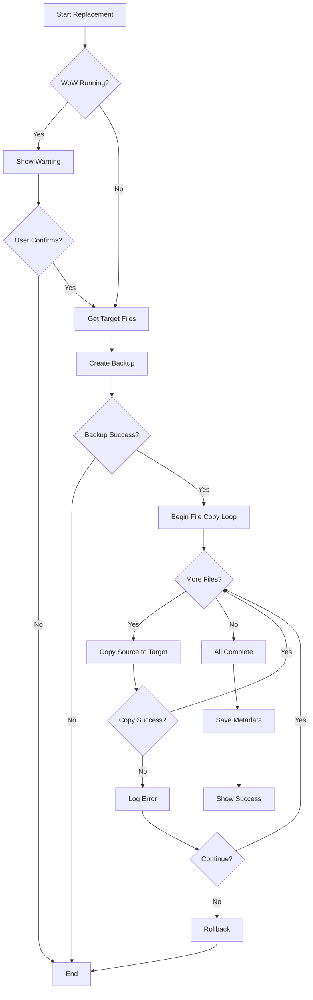

### Font Discovery Service

**Responsibilities**:
- Recursively scan directories for font files
- Filter by supported extensions
- Handle symbolic links and shortcuts
- Detect font collections (TTC files)
- Provide progress reporting for large scans
- Validate WoW compatibility (TTF format preferred)

**Interface**:

| Method | Input | Output | Purpose |
|--------|-------|--------|---------|
| ScanDirectoryAsync | directoryPath, recursive, cancellationToken | Observable<FontFileEntry> | Stream discovered fonts |
| GetSupportedExtensions | - | List<string> | Return supported file extensions |
| IsFontFile | filePath | Boolean | Quick validation of file type |

### Font Metadata Service

**Responsibilities**:
- Load fonts using SkiaSharp
- Extract metadata from font tables
- Parse OpenType/TrueType structures
- Handle font collections (multiple fonts per file)
- Detect character coverage

**Interface**:

| Method | Input | Output | Purpose |
|--------|-------|--------|---------|
| LoadFontAsync | filePath | FontMetadata | Parse and extract all metadata |
| GetFontFamilies | filePath | List<string> | List families in TTC file |
| DetectCoverageAsync | filePath | List<UnicodeRange> | Analyze character coverage |
| ValidateFont | filePath | ValidationResult | Check font integrity |

### Rendering Service

**Responsibilities**:
- Create SkiaSharp rendering contexts
- Generate preview images
- Apply rendering hints (anti-aliasing, subpixel)
- Handle text layout and shaping
- Optimize for CJK text rendering

**Interface**:

| Method | Input | Output | Purpose |
|--------|-------|--------|---------|
| RenderPreviewAsync | fontPath, config | SKBitmap | Generate preview image |
| RenderTextLayout | fontPath, text, size | TextLayout | Calculate text positioning |
| MeasureText | fontPath, text, size | TextMetrics | Get text dimensions |
| CreateTypeface | fontPath, index | SKTypeface | Load font into SkiaSharp |

**Rendering Pipeline**:

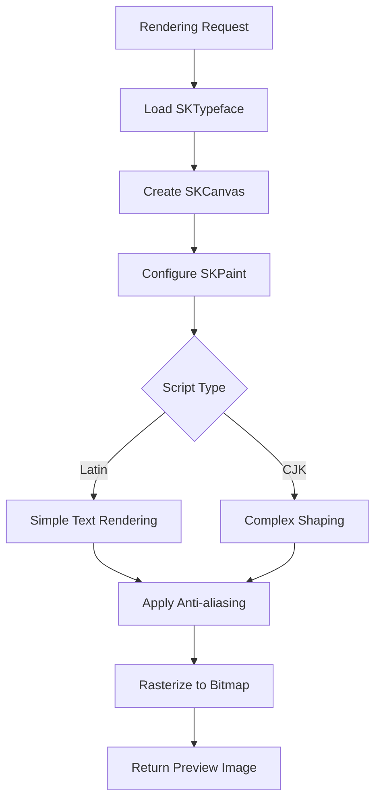

### Cache Service

**Responsibilities**:
- LRU cache for loaded typefaces
- Thumbnail preview cache
- Metadata cache
- Disk-based persistent cache for metadata

**Cache Strategy**:

| Cache Type | Max Size | Eviction Policy | Persistence |
|------------|----------|-----------------|-------------|
| Typeface Cache | 50 items | LRU | Memory only |
| Thumbnail Cache | 200 items | LRU | Disk + Memory |
| Metadata Cache | 500 items | LRU | Disk + Memory |
| Preview Render Cache | 100 items | LRU | Memory only |

**Cache Key Generation**:
- Typeface: File path + font index + modification timestamp
- Thumbnail: File path + size + modification timestamp
- Metadata: File path + modification timestamp

## State Management

### Application State

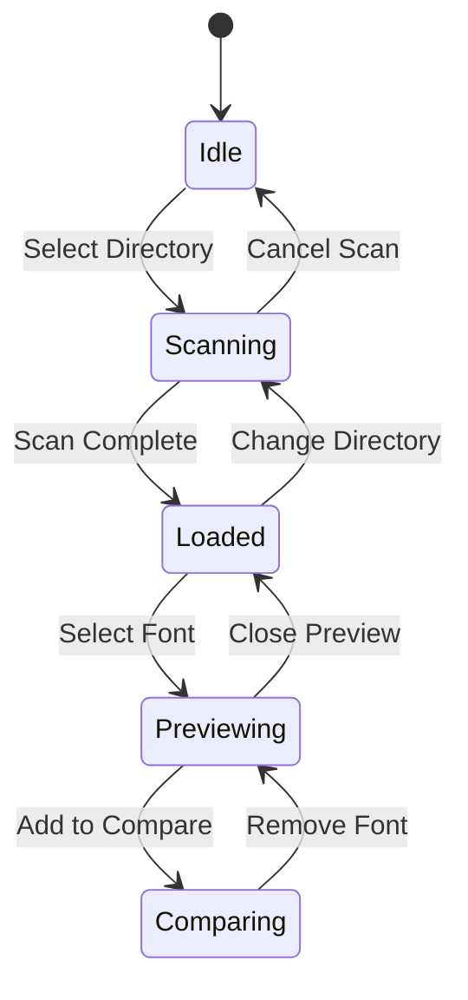

### ViewModel State Flow

| State | ViewModel Properties | User Actions Available |
|-------|---------------------|------------------------|
| **Idle** | No directory selected | Select directory, open recent |
| **Scanning** | Progress percentage, cancel token | Cancel scan |
| **Loaded** | Font list, selected directory | Browse fonts, search, filter |
| **Previewing** | Selected font, preview config | Change size, text, view metadata |
| **Comparing** | Font list (2-4 fonts), shared config | Add/remove fonts, toggle layout |

### Configuration Persistence

**User Preferences**:

| Setting | Type | Storage Location |
|---------|------|------------------|
| Last Directory | String | Application settings JSON |
| Recent Directories | List<string> | Application settings JSON (max 10) |
| Default Preview Size | Float | Application settings JSON |
| Default Sample Text | String | Application settings JSON |
| Window Position/Size | Rectangle | Application settings JSON |
| Theme Preference | Enum | Application settings JSON |
| Language Preference | String | Application settings JSON |
| Last Selected WoW Client | String | Application settings JSON |
| Default Replacement Categories | List<ReplacementCategory> | Application settings JSON |
| Auto-Backup Enabled | Boolean | Application settings JSON (default: true) |
| Backup Retention Count | Integer | Application settings JSON (default: 5) |

**Storage Path**: 
- Windows: `%APPDATA%/FontManager/settings.json`
- macOS: `~/Library/Application Support/FontManager/settings.json`

## Performance Optimization

### Font Loading Strategy

**Lazy Loading**:
- Load fonts on-demand when selected or scrolled into view
- Defer metadata extraction until metadata panel is opened
- Use file system metadata for initial list display

**Parallel Processing**:

| Operation | Parallelization Strategy |
|-----------|-------------------------|
| Directory scanning | Process subdirectories in parallel |
| Metadata extraction | Batch process with ThreadPool |
| Preview generation | Background task queue with priority |
| Character coverage analysis | Parallel Unicode block scanning |

### Memory Management

**Resource Limits**:

| Resource | Limit | Management Strategy |
|----------|-------|---------------------|
| Loaded Typefaces | 50 concurrent | LRU eviction, dispose SKTypeface |
| Preview Bitmaps | 100 MB total | Size-based eviction, dispose SKBitmap |
| Metadata Objects | 500 items | LRU eviction, JSON serialization |

**Disposal Pattern**:
- Implement IDisposable for all SkiaSharp objects
- Use weak references for cached items eligible for GC
- Explicit disposal on cache eviction

### Rendering Optimization

**CJK-Specific Optimizations**:

| Technique | Benefit |
|-----------|---------|
| Glyph atlas caching | Reuse rendered glyphs across previews |
| Text shaping cache | Cache layout calculations for sample texts |
| Incremental rendering | Render visible portion first, then complete |
| LOD rendering | Lower quality for small thumbnails |

**Target Performance Metrics**:
- Font list rendering: < 16ms per frame (60 FPS)
- Preview update: < 100ms for Latin, < 300ms for CJK
- Directory scan: Process 1000 fonts in < 5 seconds
- Metadata extraction: < 50ms per font

## Error Handling

### Error Categories

| Error Type | Handling Strategy | User Notification |
|------------|-------------------|-------------------|
| File Access Denied | Skip file, log warning | Status bar message |
| Corrupted Font File | Mark as invalid, continue | Show error icon in list |
| Unsupported Format | Skip file, log info | No notification (silent) |
| Rendering Failure | Display error placeholder | Show error in preview area |
| Out of Memory | Clear cache, retry | Warning dialog with recovery option |
| Directory Not Found | Return to idle state | Error dialog, suggest recent directories |

### Validation Flow

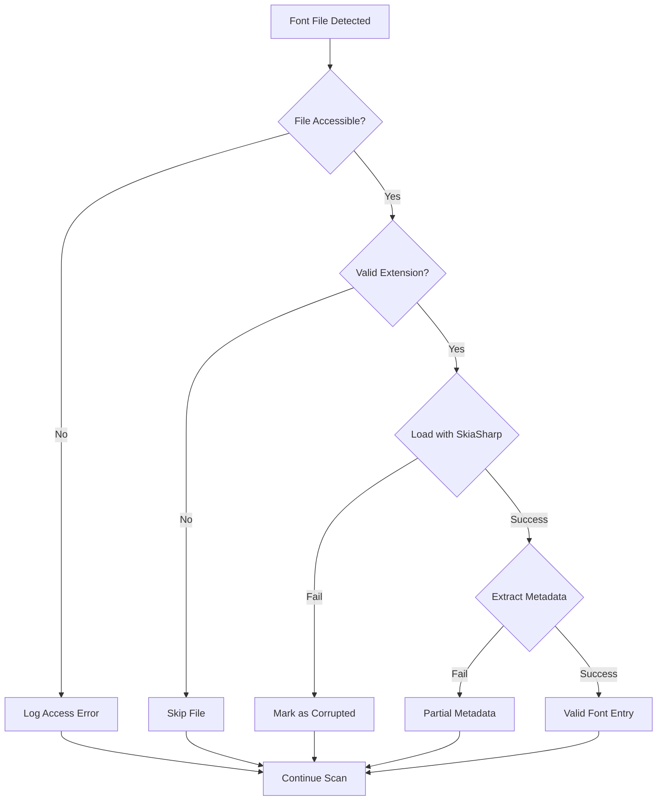

### Recovery Mechanisms

| Failure Scenario | Recovery Action |
|------------------|-----------------|
| Cache corruption | Delete cache files, rebuild from source |
| Settings file corrupt | Reset to defaults, backup corrupt file |
| Rendering crash | Fallback to text-only metadata view |
| Memory exhaustion | Emergency cache clear, reduce preview quality |

## Cross-Platform Considerations

### Platform-Specific Features

| Feature | Windows | macOS | Notes |
|---------|---------|-------|-------|
| System Font Access | Read from Windows/Fonts | Read from /Library/Fonts, ~/Library/Fonts | Requires appropriate permissions |
| File Dialog | WinUI FileOpenPicker | NSOpenPanel | Avalonia provides abstraction |
| Font Rendering | DirectWrite backend | CoreText backend | SkiaSharp handles internally |
| High DPI | Per-monitor DPI v2 | Retina scaling | Avalonia handles automatically |

### Packaging Strategy

| Platform | Package Format | Distribution |
|----------|----------------|--------------|
| Windows | Self-contained EXE, MSIX (optional) | Direct download, Microsoft Store (optional) |
| macOS | .app bundle, DMG installer | Direct download, notarized |

### Build Configuration

**Target Framework**: net8.0

**Runtime Identifiers**:
- Windows: `win-x64`, `win-arm64`
- macOS: `osx-x64`, `osx-arm64`

**Deployment Mode**: Self-contained with trimming enabled

**Expected Binary Sizes**:

| Configuration | Windows | macOS |
|---------------|---------|-------|
| Debug | 45-60 MB | 50-65 MB |
| Release (trimmed) | 18-25 MB | 20-28 MB |
| Release (compressed) | 8-12 MB | 10-15 MB |

## Testing Strategy

### Unit Testing Scope

| Component | Test Focus | Test Framework |
|-----------|------------|----------------|
| FontDiscoveryService | File enumeration, filtering, edge cases | xUnit + FluentAssertions |
| FontMetadataService | Metadata extraction accuracy, error handling | xUnit with test font fixtures |
| RenderingService | Preview generation, performance benchmarks | xUnit + BenchmarkDotNet |
| CacheService | LRU eviction, hit/miss rates | xUnit + Moq |
| ViewModels | State transitions, command execution | xUnit + Avalonia testing helpers |

### Test Data Requirements

**Test Font Collection**:

| Category | Example Fonts | Purpose |
|----------|---------------|---------|
| Latin | Arial, Times New Roman | Basic functionality |
| CJK | Noto Sans CJK, Source Han Sans | Complex glyph handling |
| Corrupted | Intentionally damaged TTF files | Error handling |
| Large | Fonts with 50,000+ glyphs | Performance testing |
| Collections | TTC files with multiple families | Multi-font handling |

### Integration Testing

**Scenarios**:
- End-to-end directory scan and preview generation
- Font comparison workflow
- Cache persistence across application restarts
- High DPI rendering on multi-monitor setups
- Large directory handling (1000+ fonts)

### Performance Benchmarks

| Metric | Target | Measurement Method |
|--------|--------|-------------------|
| Cold start time | < 2 seconds | Application launch to UI ready |
| Font scan (100 fonts) | < 2 seconds | Directory selection to list populated |
| Preview rendering | < 100ms (Latin), < 300ms (CJK) | Font selection to preview displayed |
| Memory usage (idle) | < 100 MB | Process working set |
| Memory usage (active) | < 150 MB | Process working set with previews |

## Accessibility

### Keyboard Navigation

| Action | Keyboard Shortcut |
|--------|-------------------|
| Open Directory | Ctrl/Cmd + O |
| Search Fonts | Ctrl/Cmd + F |
| Next Font | Down Arrow |
| Previous Font | Up Arrow |
| Increase Preview Size | Ctrl/Cmd + Plus |
| Decrease Preview Size | Ctrl/Cmd + Minus |
| Toggle Metadata Panel | Ctrl/Cmd + I |
| Copy Font Name | Ctrl/Cmd + C |
| Replace Fonts | Ctrl/Cmd + R |
| Select WoW Client | Ctrl/Cmd + W |
| Restore Backup | Ctrl/Cmd + Z |

### Screen Reader Support

- Provide accessible labels for all interactive elements
- Announce font names and metadata when selected
- Describe preview images with font family and sample text
- Provide text alternatives for visual-only information

### Visual Accessibility

| Feature | Implementation |
|---------|----------------|
| High Contrast Theme | Respect system high contrast settings |
| Scalable UI | Support 100% to 200% UI scaling |
| Focus Indicators | Clear visual focus for keyboard navigation |
| Color Independence | Don't rely solely on color for information |

## Extensibility

### Plugin Architecture (Future Enhancement)

**Potential Extension Points**:

| Extension Type | Purpose | Interface |
|----------------|---------|-----------|
| Font Source Provider | Add cloud storage, network shares | IFontSourceProvider |
| Export Format | PDF, image collections, font reports | IExportProvider |
| Metadata Enrichment | Add tags, ratings, custom fields | IMetadataEnricher |
| Preview Template | Custom sample texts, layouts | IPreviewTemplate |

### Configuration Extensibility

**Custom Sample Text Libraries**:
- JSON format for storing sample text collections
- User-editable templates for different use cases
- Import/export functionality for sharing configurations

**Theme Support**:
- Light and dark theme variants
- Custom color scheme definitions
- System theme synchronization
